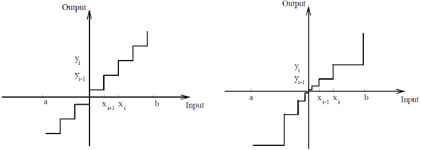
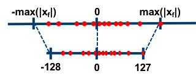

# Quantization

## :books: Surveys

<a href="https://arxiv.org/abs/2402.05964" target="_blank"><strong>A Survey on Transformer Compression</strong></a>

- **Abstract:** Transformer plays a vital role in the realms of natural language processing (NLP) and computer vision (CV), specially for constructing large language models (LLM) and large vision models (LVM). Model compression methods reduce the memory and computational cost of Transformer, which is a necessary step to implement large language/vision models on practical devices. Given the unique architecture of Transformer, featuring alternative attention and feedforward neural network (FFN) modules, specific compression techniques are usually required. The efficiency of these compression methods is also paramount, as retraining large models on the entire training dataset is usually impractical. This survey provides a comprehensive review of recent compression methods, with a specific focus on their application to Transformer-based models. The compression methods are primarily categorized into pruning, quantization, knowledge distillation, and efficient architecture design (Mamba, RetNet, RWKV, etc.). In each category, we discuss compression methods for both language and vision tasks, highlighting common underlying principles. Finally, we delve into the relation between various compression methods, and discuss further directions in this domain.
- **Comments:**

<a href="https://arxiv.org/abs/2405.10739" target="_blank"><strong>Efficient Multimodal Large Language Models: A Survey</strong></a>

- **Abstract:** In the past year, Multimodal Large Language Models (MLLMs) have demonstrated remarkable performance in tasks such as visual question answering, visual understanding and reasoning. However, the extensive model size and high training and inference costs have hindered the widespread application of MLLMs in academia and industry. Thus, studying efficient and lightweight MLLMs has enormous potential, especially in edge computing scenarios. In this survey, we provide a comprehensive and systematic review of the current state of efficient MLLMs. Specifically, we summarize the timeline of representative efficient MLLMs, research state of efficient structures and strategies, and the applications. Finally, we discuss the limitations of current efficient MLLM research and promising future directions.
- **Comments:** 

<a href="https://arxiv.org/pdf/2312.03863.pdf" target="_blank"><strong>Efficient Large Language Models: A Survey</strong></a>

- **Abstract:** Large Language Models (LLMs) have demonstrated remarkable capabilities in important tasks such as natural language understanding, language generation, and complex reasoning and have the potential to make a substantial impact on our society. Such capabilities, however, come with the considerable resources they demand, highlighting the strong need to develop effective techniques for addressing their efficiency challenges. In this survey, we provide a systematic and comprehensive review of efficient LLMs research. We organize the literature in a taxonomy consisting of three main categories, covering distinct yet interconnected efficient LLMs topics from model-centric, data-centric, and framework-centric perspective, respectively. We have also created a GitHub repository where we compile the papers featured in this survey at this https URL, this https URL, and will actively maintain this repository and incorporate new research as it emerges. We hope our survey can serve as a valuable resource to help researchers and practitioners gain a systematic understanding of the research developments in efficient LLMs and inspire them to contribute to this important and exciting field.
- **Comments:**

<a href="https://arxiv.org/abs/2308.07633" target="_blank"><strong>A Survey on Model Compression for Large Language Models</strong></a>

- **Abstract:** Large Language Models (LLMs) have revolutionized natural language processing tasks with remarkable success. However, their formidable size and computational demands present significant challenges for practical deployment, especially in resource-constrained environments. As these challenges become increasingly pertinent, the field of model compression has emerged as a pivotal research area to alleviate these limitations. This paper presents a comprehensive survey that navigates the landscape of model compression techniques tailored specifically for LLMs. Addressing the imperative need for efficient deployment, we delve into various methodologies, encompassing quantization, pruning, knowledge distillation, and more. Within each of these techniques, we highlight recent advancements and innovative approaches that contribute to the evolving landscape of LLM research. Furthermore, we explore benchmarking strategies and evaluation metrics that are essential for assessing the effectiveness of compressed LLMs. By providing insights into the latest developments and practical implications, this survey serves as an invaluable resource for both researchers and practitioners. As LLMs continue to evolve, this survey aims to facilitate enhanced efficiency and real-world applicability, establishing a foundation for future advancements in the field.
- **Comments:**

<a href="https://arxiv.org/abs/2103.13630" target="_blank"><strong>A Survey of Quantization Methods for Efficient Neural Network Inference</strong></a>

- **Abstract:** As soon as abstract mathematical computations were adapted to computation on digital computers, the problem of efficient representation, manipulation, and communication of the numerical values in those computations arose. Strongly related to the problem of numerical representation is the problem of quantization: in what manner should a set of continuous real-valued numbers be distributed over a fixed discrete set of numbers to minimize the number of bits required and also to maximize the accuracy of the attendant computations? This perennial problem of quantization is particularly relevant whenever memory and/or computational resources are severely restricted, and it has come to the forefront in recent years due to the remarkable performance of Neural Network models in computer vision, natural language processing, and related areas. Moving from floating-point representations to low-precision fixed integer values represented in four bits or less holds the potential to reduce the memory footprint and latency by a factor of 16x; and, in fact, reductions of 4x to 8x are often realized in practice in these applications. Thus, it is not surprising that quantization has emerged recently as an important and very active sub-area of research in the efficient implementation of computations associated with Neural Networks. In this article, we survey approaches to the problem of quantizing the numerical values in deep Neural Network computations, covering the advantages/disadvantages of current methods. With this survey and its organization, we hope to have presented a useful snapshot of the current research in quantization for Neural Networks and to have given an intelligent organization to ease the evaluation of future research in this area.
- **Comments:**

<a href="https://arxiv.org/abs/2205.07877" target="_blank"><strong>A Comprehensive Survey on Model Quantization for Deep Neural Networks in Image Classification</strong></a>

- **Abstract:** Recent advancements in machine learning achieved by Deep Neural Networks (DNNs) have been significant. While demonstrating high accuracy, DNNs are associated with a huge number of parameters and computations, which leads to high memory usage and energy consumption. As a result, deploying DNNs on devices with constrained hardware resources poses significant challenges. To overcome this, various compression techniques have been widely employed to optimize DNN accelerators. A promising approach is quantization, in which the full-precision values are stored in low bit-width precision. Quantization not only reduces memory requirements but also replaces high-cost operations with low-cost ones. DNN quantization offers flexibility and efficiency in hardware design, making it a widely adopted technique in various methods. Since quantization has been extensively utilized in previous works, there is a need for an integrated report that provides an understanding, analysis, and comparison of different quantization approaches. Consequently, we present a comprehensive survey of quantization concepts and methods, with a focus on image classification. We describe clustering-based quantization methods and explore the use of a scale factor parameter for approximating full-precision values. Moreover, we thoroughly review the training of a quantized DNN, including the use of a straight-through estimator and quantization regularization. We explain the replacement of floating-point operations with low-cost bitwise operations in a quantized DNN and the sensitivity of different layers in quantization. Furthermore, we highlight the evaluation metrics for quantization methods and important benchmarks in the image classification task. We also present the accuracy of the state-of-the-art methods on CIFAR-10 and ImageNet.
- **Comments:**

<a href="https://ieeexplore.ieee.org/abstract/document/10509805" target="_blank"><strong>A Review of State-of-the-Art Mixed-Precision Neural Network Frameworks</strong></a>

- **Abstract:** Mixed-precision Deep Neural Networks (DNNs) provide an efficient solution for hardware deployment, especially under resource constraints, while maintaining model accuracy. Identifying the ideal bit precision for each layer, however, remains a challenge given the vast array of models, datasets, and quantization schemes, leading to an expansive search space. Recent literature has addressed this challenge, resulting in several promising frameworks. This paper offers a comprehensive overview of the standard quantization classifications prevalent in existing studies. A detailed survey of current mixed-precision frameworks is provided, with an in-depth comparative analysis highlighting their respective merits and limitations. The paper concludes with insights into potential avenues for future research in this domain.

<a href="https://ieeexplore.ieee.org/abstract/document/10509805" target="_blank"><strong>Model Quantization and Hardware Acceleration for Vision Transformers: A Comprehensive Survey </strong></a> 
 

- **Abstract:** Vision Transformers (ViTs) have recently garnered considerable attention, emerging as a promising alternative to convolutional neural networks (CNNs) in several vision-related applications. However, their large model sizes and high computational and memory demands hinder deployment, especially on resource-constrained devices. This underscores the necessity of algorithm-hardware co-design specific to ViTs, aiming to optimize their performance by tailoring both the algorithmic structure and the underlying hardware accelerator to each other's strengths. Model quantization, by converting high-precision numbers to lower-precision, reduces the computational demands and memory needs of ViTs, allowing the creation of hardware specifically optimized for these quantized algorithms, boosting efficiency. This article provides a comprehensive survey of ViTs quantization and its hardware acceleration. We first delve into the unique architectural attributes of ViTs and their runtime characteristics. Subsequently, we examine the fundamental principles of model quantization, followed by a comparative analysis of the state-of-the-art quantization techniques for ViTs. Additionally, we explore the hardware acceleration of quantized ViTs, highlighting the importance of hardware-friendly algorithm design. In conclusion, this article will discuss ongoing challenges and future research paths. We consistently maintain the related open-source materials at [this https URL](https://github.com/DD-DuDa/awesome-vit-quantization-acceleration).

## :clipboard: Research Papers

<a href="https://arxiv.org/abs/2306.07215" target="_blank"><strong>17. Efficient Quantization-aware Training with Adaptive Coreset Selection</strong></a>

- **Abstract:** The expanding model size and computation of deep neural networks (DNNs) have increased the demand for efficient model deployment methods. Quantization-aware training (QAT) is a representative model compression method to leverage redundancy in weights and activations. However, most existing QAT methods require end-to-end training on the entire dataset, which suffers from long training time and high energy costs. Coreset selection, aiming to improve data efficiency utilizing the redundancy of training data, has also been widely used for efficient training. In this work, we propose a new angle through the coreset selection to improve the training efficiency of quantization-aware training. Based on the characteristics of QAT, we propose two metrics: error vector score and disagreement score, to quantify the importance of each sample during training. Guided by these two metrics of importance, we proposed a quantization-aware adaptive coreset selection (ACS) method to select the data for the current training epoch. We evaluate our method on various networks (ResNet-18, MobileNetV2), datasets(CIFAR-100, ImageNet-1K), and under different quantization settings. Compared with previous coreset selection methods, our method significantly improves QAT performance with different dataset fractions. Our method can achieve an accuracy of 68.39% of 4-bit quantized ResNet-18 on the ImageNet-1K dataset with only a 10% subset, which has an absolute gain of 4.24% compared to the baseline.
- **Comments:** [Code](https://github.com/HuangOwen/QAT-ACS)

<a href="https://arxiv.org/abs/2308.04595" target="_blank"><strong>16. Quantization Aware Factorization for Deep Neural Network Compression</strong></a>

- **Abstract:** Tensor decomposition of convolutional and fully-connected layers is an effective way to reduce parameters and FLOP in neural networks. Due to memory and power consumption limitations of mobile or embedded devices, the quantization step is usually necessary when pre-trained models are deployed. A conventional post-training quantization approach applied to networks with decomposed weights yields a drop in accuracy. This motivated us to develop an algorithm that finds tensor approximation directly with quantized factors and thus benefit from both compression techniques while keeping the prediction quality of the model. Namely, we propose to use Alternating Direction Method of Multipliers (ADMM) for Canonical Polyadic (CP) decomposition with factors whose elements lie on a specified quantization grid. We compress neural network weights with a devised algorithm and evaluate it's prediction quality and performance. We compare our approach to state-of-the-art post-training quantization methods and demonstrate competitive results and high flexibility in achiving a desirable quality-performance tradeoff.
- **Limitations:** experiments are not well designed. High accuracy degradation. Lack of comprehensive comparison. Only applicable to weights.
- **Comments:**

<a href="https://openaccess.thecvf.com/content/CVPR2023/html/Liu_PD-Quant_Post-Training_Quantization_Based_on_Prediction_Difference_Metric_CVPR_2023_paper.html" target="_blank"><strong>15. PD-Quant: Post-Training Quantization Based on Prediction Difference Metric</strong></a>

- **Abstract:** Post-training quantization (PTQ) is a neural network compression technique that converts a full-precision model into a quantized model using lower-precision data types. Although it can help reduce the size and computational cost of deep neural networks, it can also introduce quantization noise and reduce prediction accuracy, especially in extremely low-bit settings. How to determine the appropriate quantization parameters (e.g., scaling factors and rounding of weights) is the main problem facing now. Existing methods attempt to determine these parameters by minimize the distance between features before and after quantization, but such an approach only considers local information and may not result in the most optimal quantization parameters. We analyze this issue and propose PD-Quant, a method that addresses this limitation by considering global information. It determines the quantization parameters by using the information of differences between network prediction before and after quantization. In addition, PD-Quant can alleviate the overfitting problem in PTQ caused by the small number of calibration sets by adjusting the distribution of activations. Experiments show that PD-Quant leads to better quantization parameters and improves the prediction accuracy of quantized models, especially in low-bit settings. For example, PD-Quant pushes the accuracy of ResNet-18 up to 53.14% and RegNetX-600MF up to 40.67% in weight 2-bit activation 2-bit.
- **Comments:** [Code](https://github.com/hustvl/PD-Quant)

<a href="https://arxiv.org/abs/2204.12322" target="_blank"><strong>14. RAPQ: Rescuing Accuracy for Power-of-Two Low-bit Post-training Quantization</strong></a>

- **Abstract:** We introduce a Power-of-Two low-bit post-training quantization(PTQ) method for deep neural network that meets hardware requirements and does not call for long-time retraining. Power-of-Two quantization can convert the multiplication introduced by quantization and dequantization to bit-shift that is adopted by many efficient accelerators. However, the Power-of-Two scale factors have fewer candidate values, which leads to more rounding or clipping errors. We propose a novel Power-of-Two PTQ framework, dubbed RAPQ, which dynamically adjusts the Power-of-Two scales of the whole network instead of statically determining them layer by layer. It can theoretically trade off the rounding error and clipping error of the whole network. Meanwhile, the reconstruction method in RAPQ is based on the BN information of every unit. Extensive experiments on ImageNet prove the excellent performance of our proposed method. Without bells and whistles, RAPQ can reach accuracy of 65% and 48% on ResNet-18 and MobileNetV2 respectively with weight INT2 activation INT4. We are the first to propose the more constrained but hardware-friendly Power-of-Two quantization scheme for low-bit PTQ specially and prove that it can achieve nearly the same accuracy as SOTA PTQ method. The code was released.
- **Comments:** [Code](https://github.com/BillAmihom/RAPQ)

<a href="https://www.ecva.net/papers/eccv_2022/papers_ECCV/papers/136710657.pdf" target="_blank"><strong>13. Non-uniform Step Size Quantization for Accurate Post-training Quantization</strong></a>

- **Abstract:** Quantization is a very effective optimization technique to reduce hardware cost and memory footprint of deep neural network (DNN) accelerators. In particular, post-training quantization (PTQ) is often preferred as it does not require a full dataset or costly retraining. However, performance of PTQ lags significantly behind that of quantization-aware training especially for low-precision networks (4-bit). In this paper we propose a novel PTQ scheme (Code will be publicly available at https://github.com/sogh5/SubsetQ) to bridge the gap, with minimal impact on hardware cost. The main idea of our scheme is to increase arithmetic precision while retaining the same representational precision. The excess arithmetic precision enables us to better match the input data distribution while also presenting a new optimization problem, to which we propose a novel search-based solution. Our scheme is based on logarithmic-scale quantization, which can help reduce hardware cost through the use of shifters instead of multipliers. Our evaluation results using various DNN models on challenging computer vision tasks (image classification, object detection, semantic segmentation) show superior accuracy compared with the state-of-the-art PTQ methods at various low-bit precisions.
- **Comments:**

<a href="https://openaccess.thecvf.com/content/CVPR2021/papers/Oh_Automated_Log-Scale_Quantization_for_Low-Cost_Deep_Neural_Networks_CVPR_2021_paper.pdf" target="_blank"><strong>12. Automated Log-Scale Quantization for Low-Cost Deep Neural Networks</strong></a>

- **Abstract:** Quantization plays an important role in deep neural network (DNN) hardware. In particular, logarithmic quantization has multiple advantages for DNN hardware implementations, and its weakness in terms of lower performance at high precision compared with linear quantization has been recently remedied by what we call selective two-word logarithmic quantization (STLQ). However, there is a lack of training methods designed for STLQ or even logarithmic quantization in general. In this paper we propose a novel STLQ-aware training method, which significantly out-performs the previous state-of-the-art training method for STLQ. Moreover, our training results demonstrate that with our new training method, STLQ applied to weight parameters of ResNet-18 can achieve the same level of performance as state-of-the-art quantization method, APoT, at 3-bit precision. We also apply our method to various DNNs in image enhancement and semantic segmentation, showing competitive results.
- **Comments:**

<a href="https://arxiv.org/abs/1909.13144" target="_blank"><strong>11. Additive Powers-of-Two Quantization: An Efficient Non-uniform Discretization for Neural Networks</strong></a>

- **Abstract:** We propose Additive Powers-of-Two~(APoT) quantization, an efficient non-uniform quantization scheme for the bell-shaped and long-tailed distribution of weights and activations in neural networks. By constraining all quantization levels as the sum of Powers-of-Two terms, APoT quantization enjoys high computational efficiency and a good match with the distribution of weights. A simple reparameterization of the clipping function is applied to generate a better-defined gradient for learning the clipping threshold. Moreover, weight normalization is presented to refine the distribution of weights to make the training more stable and consistent. Experimental results show that our proposed method outperforms state-of-the-art methods, and is even competitive with the full-precision models, demonstrating the effectiveness of our proposed APoT quantization. For example, our 4-bit quantized ResNet-50 on ImageNet achieves 76.6% top-1 accuracy without bells and whistles; meanwhile, our model reduces 22% computational cost compared with the uniformly quantized counterpart.
- **Comments:** [Code](https://github.com/yhhhli/APoT_Quantization)

<a href="https://arxiv.org/abs/2309.05516" target="_blank"><strong>10. Optimize Weight Rounding via Signed Gradient Descent for the Quantization of LLMs</strong></a>

- **TLDR:**
- **Abstract:** Large Language Models (LLMs) have proven their exceptional capabilities in performing language-related tasks. However, their deployment poses significant challenges due to their considerable memory and storage requirements. In response to this issue, weight-only quantization, particularly 3 and 4-bit weight-only quantization, has emerged as one of the most viable solutions. As the number of bits decreases, the quantization grid broadens, thus emphasizing the importance of up and down rounding. While previous studies have demonstrated that fine-tuning up and down rounding with the addition of perturbations can enhance accuracy in some scenarios, our study is driven by the precise and limited boundary of these perturbations, where only the threshold for altering the rounding value is of significance. Consequently, we propose a concise and highly effective approach for optimizing the weight rounding task. Our method, named SignRound, involves lightweight block-wise tuning using signed gradient descent, enabling us to achieve outstanding results within 400 steps. SignRound competes impressively against recent methods without introducing additional inference overhead.
- **What:**
- **Methodology:**
- **Conclusions:**
- **Limitations:**
- **Comments:** Contaning a comprehensive comparison.

<a href="https://arxiv.org/abs/2210.17323" target="_blank"><strong>9. GPTQ: Accurate Post-Training Quantization for Generative Pre-trained Transformers</strong></a>

- **TLDR:**
- **Abstract:** Generative Pre-trained Transformer models, known as GPT or OPT, set themselves apart through breakthrough performance across complex language modelling tasks, but also by their extremely high computational and storage costs. Specifically, due to their massive size, even inference for large, highly-accurate GPT models may require multiple performant GPUs, which limits the usability of such models. While there is emerging work on relieving this pressure via model compression, the applicability and performance of existing compression techniques is limited by the scale and complexity of GPT models. In this paper, we address this challenge, and propose GPTQ, a new one-shot weight quantization method based on approximate second-order information, that is both highly-accurate and highly-efficient. Specifically, GPTQ can quantize GPT models with 175 billion parameters in approximately four GPU hours, reducing the bitwidth down to 3 or 4 bits per weight, with negligible accuracy degradation relative to the uncompressed baseline. Our method more than doubles the compression gains relative to previously-proposed one-shot quantization methods, preserving accuracy, allowing us for the first time to execute an 175 billion-parameter model inside a single GPU for generative inference. Moreover, we also show that our method can still provide reasonable accuracy in the extreme quantization regime, in which weights are quantized to 2-bit or even ternary quantization levels. We show experimentally that these improvements can be leveraged for end-to-end inference speedups over FP16, of around 3.25x when using high-end GPUs (NVIDIA A100) and 4.5x when using more cost-effective ones (NVIDIA A6000). The implementation is available at this https URL.
- **What:**
- **Methodology:**
- **Conclusions:**
- **Limitations:**
- **Comments:** Foundation.

<a href="https://arxiv.org/abs/2402.15319" target="_blank"><strong>8. GPTVQ: The Blessing of Dimensionality for LLM Quantization</strong></a>

- **TLDR:**
- **Abstract:** In this work we show that the size versus accuracy trade-off of neural network quantization can be significantly improved by increasing the quantization dimensionality. We propose the GPTVQ method, a new fast method for post-training vector quantization (VQ) that scales well to Large Language Models (LLMs). Our method interleaves quantization of one or more columns with updates to the remaining unquantized weights, using information from the Hessian of the per-layer output reconstruction MSE. Quantization codebooks are initialized using an efficient data-aware version of the EM algorithm. The codebooks are then updated, and further compressed by using integer quantization and SVD-based compression. GPTVQ establishes a new state-of-the art in the size vs accuracy trade-offs on a wide range of LLMs such as Llama-v2 and Mistral. Furthermore, our method is efficient: on a single H100 it takes between 3 and 11 hours to process a Llamav2-70B model, depending on quantization setting. Lastly, with on-device timings for VQ decompression on a mobile CPU we show that VQ leads to improved latency compared to using a 4-bit integer format.
- **What:**
- **Methodology:**
- **Conclusions:**
- **Limitations:**
- **Comments:** SVD.

<a href="https://arxiv.org/abs/2310.08659" target="_blank"><strong>7. LoftQ: LoRA-Fine-Tuning-Aware Quantization for Large Language Models </strong></a>
 
  

- **TLDR:** LoftQ finds good enough quantized LoRA initialization: quantized backbone Q and LoRA adapters A and B, given a pre-trained weight W.
- **Abstract:** Quantization is an indispensable technique for serving Large Language Models (LLMs) and has recently found its way into LoRA fine-tuning. In this work we focus on the scenario where quantization and LoRA fine-tuning are applied together on a pre-trained model. In such cases it is common to observe a consistent gap in the performance on downstream tasks between full fine-tuning and quantization plus LoRA fine-tuning approach. In response, we propose LoftQ (LoRA-Fine-Tuning-aware Quantization), a novel quantization framework that simultaneously quantizes an LLM and finds a proper low-rank initialization for LoRA fine-tuning. Such an initialization alleviates the discrepancy between the quantized and full-precision model and significantly improves generalization in downstream tasks. We evaluate our method on natural language understanding, question answering, summarization, and natural language generation tasks. Experiments show that our method is highly effective and outperforms existing quantization methods, especially in the challenging 2-bit and 2/4-bit mixed precision regimes.
- 

<a href="https://arxiv.org/abs/2106.09685" target="_blank"><strong>6. LoRA: Low-Rank Adaptation of Large Language Models</strong></a>

- **TLDR:**
- **Abstract:** An important paradigm of natural language processing consists of large-scale pre-training on general domain data and adaptation to particular tasks or domains. As we pre-train larger models, full fine-tuning, which retrains all model parameters, becomes less feasible. Using GPT-3 175B as an example -- deploying independent instances of fine-tuned models, each with 175B parameters, is prohibitively expensive. We propose Low-Rank Adaptation, or LoRA, which freezes the pre-trained model weights and injects trainable rank decomposition matrices into each layer of the Transformer architecture, greatly reducing the number of trainable parameters for downstream tasks. Compared to GPT-3 175B fine-tuned with Adam, LoRA can reduce the number of trainable parameters by 10,000 times and the GPU memory requirement by 3 times. LoRA performs on-par or better than fine-tuning in model quality on RoBERTa, DeBERTa, GPT-2, and GPT-3, despite having fewer trainable parameters, a higher training throughput, and, unlike adapters, no additional inference latency. We also provide an empirical investigation into rank-deficiency in language model adaptation, which sheds light on the efficacy of LoRA. We release a package that facilitates the integration of LoRA with PyTorch models and provide our implementations and model checkpoints for RoBERTa, DeBERTa, and GPT-2.
- **What:**
- **Methodology:**
- **Conclusions:**
- **Limitations:**
- **Comments:**: foundation paper.

<a href="https://arxiv.org/abs/1510.00149" target="_blank"><strong>5. Deep Compression: Compressing Deep Neural Networks with Pruning, Trained Quantization and Huffman Coding</strong></a>

- **TLDR:**
- **Abstract:** Neural networks are both computationally intensive and memory intensive, making them difficult to deploy on embedded systems with limited hardware resources. To address this limitation, we introduce "deep compression", a three stage pipeline: pruning, trained quantization and Huffman coding, that work together to reduce the storage requirement of neural networks by 35x to 49x without affecting their accuracy. Our method first prunes the network by learning only the important connections. Next, we quantize the weights to enforce weight sharing, finally, we apply Huffman coding. After the first two steps we retrain the network to fine tune the remaining connections and the quantized centroids. Pruning, reduces the number of connections by 9x to 13x; Quantization then reduces the number of bits that represent each connection from 32 to 5. On the ImageNet dataset, our method reduced the storage required by AlexNet by 35x, from 240MB to 6.9MB, without loss of accuracy. Our method reduced the size of VGG-16 by 49x from 552MB to 11.3MB, again with no loss of accuracy. This allows fitting the model into on-chip SRAM cache rather than off-chip DRAM memory. Our compression method also facilitates the use of complex neural networks in mobile applications where application size and download bandwidth are constrained. Benchmarked on CPU, GPU and mobile GPU, compressed network has 3x to 4x layerwise speedup and 3x to 7x better energy efficiency.
- **What:**
- **Methodology:**
  

    
  

  

    
  

- **Conclusions:**
  

    
  

- **Limitations:**
  - only save storage, doesn't accelerate training/inference speed
  - complicated implementation
- **Comments:** hybrid compression.

<a href="https://arxiv.org/abs/1712.05877" target="_blank"><strong>4. Quantization and Training of Neural Networks for Efficient Integer-Arithmetic-Only Inference</strong></a>

- **TLDR:** .
- **Abstract:** The rising popularity of intelligent mobile devices and the daunting computational cost of deep learning-based models call for efficient and accurate on-device inference schemes. We propose a quantization scheme that allows inference to be carried out using integer-only arithmetic, which can be implemented more efficiently than floating point inference on commonly available integer-only hardware. We also co-design a training procedure to preserve end-to-end model accuracy post quantization. As a result, the proposed quantization scheme improves the tradeoff between accuracy and on-device latency. The improvements are significant even on MobileNets, a model family known for run-time efficiency, and are demonstrated in ImageNet classification and COCO detection on popular CPUs.
- **What:** an affine mapping of integers $q$ to real numbers $r$, expressed as $r = S(q − Z)$ where $S$ is scaling and $Z$ is zero-point parameter.
- **Methodology:** Integer-arithmetic-only quantization, including: integer-arithmetic-only inference, simulated quantization training.
- **Conclusions:**
- **Limitations:**
- **Comments:**

<a href="https://www.youtube.com/watch?v=MK4k64vY3xo&ab_channel=MITHANLab" target="_blank"><strong>3. EfficientML.ai Lecture 5 - Quantization</strong></a>

- **TLDR:** fundamental.
- **Definitions:**
    - Quantization is the process of constraining an input from a continuous or otherwise large set of values (such as the real numbers) to a discrete set (such as the integers).
    - The difference between an input value and its quantized value
    is referred to as quantization error.
    

    
    

- **Categorization:**
    - K-Means-Based Quantization: apply quantization-aware training.
    - Linear Quantization: apply integer-only inference.
    

    
    

- **Comments:**
    - Notebook: https://colab.research.google.com/drive/1z0D3pBb3uy3VvK0Lu01d5C_Sq1j7d-rt?usp=sharing
    - Solution: https://github.com/yifanlu0227/MIT-6.5940/tree/main

<a href="https://arxiv.org/abs/2306.00978" target="_blank"><strong>2. AWQ: Activation-aware Weight Quantization for LLM Compression and Acceleration</strong></a>

- **TLDR:** .
- **Abstract:** Large language models (LLMs) have shown excellent performance on various tasks, but the astronomical model size raises the hardware barrier for serving (memory size) and slows down token generation (memory bandwidth). In this paper, we propose Activation-aware Weight Quantization (AWQ), a hardware-friendly approach for LLM low-bit weight-only quantization. Our method is based on the observation that weights are not equally important: protecting only 1% of salient weights can greatly reduce quantization error. We then propose to search for the optimal per-channel scaling that protects the salient weights by observing the activation, not weights. AWQ does not rely on any backpropagation or reconstruction, so it can well preserve LLMs' generalization ability on different domains and modalities, without overfitting to the calibration set. AWQ outperforms existing work on various language modeling and domain-specific benchmarks. Thanks to better generalization, it achieves excellent quantization performance for instruction-tuned LMs and, for the first time, multi-modal LMs. Alongside AWQ, we implement an efficient and flexible inference framework tailored for LLMs on the edge, offering more than 3x speedup over the Huggingface FP16 implementation on both desktop and mobile GPUs. It also democratizes the deployment of the 70B Llama-2 model on mobile GPU (NVIDIA Jetson Orin 64GB).
- **What:**
  - LLMs's large size leads to high cost.
  - Quantization-aware training (QAT): high training cost. Post-training quantization (PTQ) suffers from large accuracy degradation under a low-bit setting. GPTQ distorts the learned features on out-of-distribution domains.
- **Observation:**
  - Weights are not equally important. Weight channels corresponding to larger activation magnitudes are more salient since they process more important features.
    
  - Selecting weights based on activation magnitude can significantly improve the performance: keeping only 0.1%-1% of the channels corresponding to larger activation significantly improves the quantized performance.
  - Such a mixed-precision data type will make the system implementation difficult.

- **Methodology:**
  - To avoid the hardware-inefficient mixed-precision implementation: scaling up the salient channels can reduce their relative quantization error.
  
  - To consider both salient and non-salient weights: automatically search for an optimal (per input channel) scaling factor that minimizes the output difference after quantization for a certain layer.
  
- **Conclusions:**
- **Limitations:**
- **Comments:**
  - Why $0.1\%$ salaient weights? How to define the portion of salient weight? Should we make it adaptive  (*e.g.,* per layer)
  - How do we select salient channels? Anything else better than activation distribution?
  - Any optimization techniques without mixed precision
  - **Decompose (*e.g.,* SVD, which (weight, activation, gradient), in which data form) then quantize factor matrices.**

<a href="https://arxiv.org/abs/2311.12023" target="_blank"><strong>1. LQ-LoRA: Low-rank Plus Quantized Matrix Decomposition for Efficient Language Model Finetuning</strong></a>

- **TLDR:** Decompose a matrix into low-rank component and a memory-efficient quantized component.
- **Abstract:** We propose a simple approach for memory-efficient adaptation of pretrained language models. Our approach uses an iterative algorithm to decompose each pretrained matrix into a high-precision low-rank component and a memory-efficient quantized component. During finetuning, the quantized component remains fixed and only the low-rank component is updated. We present an integer linear programming formulation of the quantization component which enables dynamic configuration of quantization parameters (e.g., bit-width, block size) for each matrix given an overall target memory budget. We further explore a data-aware version of the algorithm which uses an approximation of the Fisher information matrix to weight the reconstruction objective during matrix decomposition. Experiments on adapting RoBERTa and LLaMA-2 (7B and 70B) demonstrate that our low-rank plus quantized matrix decomposition approach (LQ-LoRA) outperforms strong QLoRA and GPTQ-LoRA baselines and moreover enables more aggressive quantization. For example, on the OpenAssistant benchmark LQ-LoRA is able to learn a 2.5-bit LLaMA-2 model that is competitive with a model finetuned with 4-bit QLoRA. When finetuned on a language modeling calibration dataset, LQ-LoRA can also be used for model compression; in this setting our 2.75-bit LLaMA-2-70B model (which has 2.85 bits on average when including the low-rank components and requires 27GB of GPU memory) is competitive with the original model in full precision.
- **What:**
- **Methodology:**
- **Conclusions:**
- **Limitations:**
- **Comments:** First paper.

## :computer: Repositories
- [Advanced Digital Signal Processing Notebooks and Tutorials](https://github.com/TUIlmenauAMS/ADSP_Tutorials) 
- [Awesome-Quantization-Papers](https://github.com/Zhen-Dong/Awesome-Quantization-Papers) 
- [Awesome Model Quantization](https://github.com/htqin/awesome-model-quantization) 
- [Efficient Large Language Models: A Survey](https://github.com/AIoT-MLSys-Lab/Efficient-LLMs-Survey) 
- [Awesome LLM Compression](https://github.com/HuangOwen/Awesome-LLM-Compression) 
- [neural-compressor](https://github.com/intel/neural-compressor/blob/master/docs/source/quantization.md) 
- [AutoGPTQ](https://github.com/AutoGPTQ/AutoGPTQ) 
- [IST Austria Distributed Algorithms and Systems Lab](https://github.com/IST-DASLab)
- [Practical Quantization in PyTorch](https://pytorch.org/blog/quantization-in-practice/)
- [Brevitas: neural network quantization in PyTorch](https://github.com/Xilinx/brevitas) 
- [TinyML and Efficient Deep Learning Computing](https://hanlab.mit.edu/courses/2023-fall-65940)
- [Hardware for Machine Learning](https://inst.eecs.berkeley.edu/~ee290-2/sp24/)
- [ECE 5545: Machine Learning Hardware and Systems](https://abdelfattah-class.github.io/ece5545/sp24)
- [coremltools](https://apple.github.io/coremltools/docs-guides/source/quantization-overview.html#:~:text=Linear%20quantization%2C%20also%20known%20as,128%5D%2C%20and%20interpolating%20linearly.)
- [🤗 Optimum Quantization](https://huggingface.co/docs/optimum/en/concept_guides/quantization)
- [Neural Network Quantization with AI Model Efficiency Toolkit (AIMET)](https://arxiv.org/abs/2201.08442) 
- [TensorRT Model Optimizer](https://github.com/NVIDIA/TensorRT-Model-Optimizer) 

## :information_source: Terminology
- **Post Training Quantization (PTQ)** computes `scale` after network has been trained. A *representative dataset* is used to capture the distribution of activations for each activation tensor, then this distribution data is used to compute the `scale` value for each tensor. Each weight's distribution is used to compute weight `scale`. This flow is called *calibration*.
- **Quantization Aware Training (QAT)** aims at computing scale factors during training. All weights and activations are *fake quantized* during both the forward and backward passes of training: that is, float values are rounded to mimic int8 values, but all computations are still done with floating point numbers. Thus, all the weight adjustments during training are made while *aware* of the fact that the model will ultimately be quantized; after quantizing, therefore, this method usually yields higher accuracy.
- **Vector quantization (VQ)** quantizing continuous or discrete data into a finite set of representative vectors, known as codebook vectors or centroids.
- **Linear quantization**, also known as **affine quantization**, maps the range of float values to a quantized range, such as the range for 8-bit integers [-127, 128], and interpolating linearly.
- **Uniform** quantization: the signal amplitude range is divided into equal intervals, and each interval is assigned a quantization level.
- **Non-uniform** quantization: the signal amplitude range is divided into unequal intervals, and each interval is assigned a quantization level.
  

      
  

- **Asymmetric**: In asymmetric mode, we map the min/max in the float range to the min/max of the integer range. This is done by using a zero-point (also called quantization bias, or offset) in addition to the scale factor.
- **Symmetric**: In symmetric mode, instead of mapping the exact min/max of the float range to the quantized range, we choose the maximum absolute value between min/max. In addition, we don't use a zero-point. So, the floating-point range we're effectively quantizing is symmetric with respect to zero, and so is the quantized range.
  

    
    
  

- **Per tensor** means that all the values within the tensor are quantized the same way with the same quantization parameters. **Per channel** means that for each dimension, typically the channel dimension of a tensor, the values in the tensor are quantized with different quantization parameters. This allows for less error in converting tensors to quantized values since outlier values would only impact the channel it was in, instead of the entire Tensor.

## :herb: Category
Abbreviation:
- PoT: Power-of-Two
- ### Data-free Quantization (DFQ)
| Paper                                                        | Venue      | Year | Note |
| ------------------------------------------------------------ | ---------- | ---- | ---- |
| [ACQ: Improving generative data-free quantization via attention correction](https://doi.org/10.1016/j.patcog.2024.110444) | PR | 2024 |
| [DFFG: Fast Gradient Iteration for Data-free Quantization](https://papers.bmvc2023.org/0514.pdf) | BMVC | 2023 |

### Post Training Quantization (PTQ)
| Paper                                                        | Venue      | Year | Note |
| ------------------------------------------------------------ | ---------- | ---- | ---- |
| [Outlier-aware Slicing for Post-Training Quantization in Vision Transformer](https://openreview.net/forum?id=Uh5XN9d2J4)| ICML | 2024 | PoT |
| [P2-ViT: Power-of-Two Post-Training Quantization and Acceleration for Fully Quantized Vision Transformer](https://arxiv.org/abs/2405.19915) | Arxiv | 2024 | PoT |
| [Stabilized activation scale estimation for precise Post-Training Quantization](https://www.sciencedirect.com/science/article/pii/S0925231223012432) | NC | 2024 |
| [PD-Quant: Post-Training Quantization based on Prediction Difference Metric](https://arxiv.org/abs/2212.07048) | CVPR | 2023 | Uniform |
| [Adaptive Data-Free Quantization](https://arxiv.org/abs/2303.06869) | CVPR | 2023 |
| [Solving Oscillation Problem in Post-Training Quantization Through a Theoretical Perspective](https://arxiv.org/abs/2303.11906) | CVPR | 2023 |
| [Bit-shrinking: Limiting Instantaneous Sharpness for Improving Post-training Quantization](https://openaccess.thecvf.com/content/CVPR2023/papers/Lin_Bit-Shrinking_Limiting_Instantaneous_Sharpness_for_Improving_Post-Training_Quantization_CVPR_2023_paper.pdf)| CVPR | 2023 |
| [Genie: Show Me the Data for Quantization](https://arxiv.org/abs/2212.04780) | CVPR | 2023 |
| [Pruning vs Quantization: Which is Better?](https://arxiv.org/abs/2307.02973) | NeurIPS | 2023 | Symmetric |
| [PowerQuant: Automorphism Search for Non-Uniform Quantization](https://arxiv.org/abs/2301.09858) | ICLR | 2023 | Exponent |
| [O-2A: Outlier-Aware Compression for 8-bit Post-Training Quantization Model](https://ieeexplore.ieee.org/abstract/document/10237192) | IEEE Access | 2023 |
| [Post-training Quantization for Neural Networks with Provable Guarantees](https://arxiv.org/abs/2201.11113) | SIMODS | 2023 |
| [RAPQ: Rescuing Accuracy for Power-of-Two Low-bit Post-training Quantization](https://arxiv.org/abs/2212.07048) | IJCAI | 2022 | PoT |
| [Non-uniform Step Size Quantization for Accurate Post-training Quantization](https://www.ecva.net/papers/eccv_2022/papers_ECCV/papers/136710657.pdf) | ECCV | 2022 |
| [QDrop: Randomly Dropping Quantization for Extremely Low-bit Post-Training Quantization](https://arxiv.org/abs/2203.05740) | ICLR | 2022 | Uniform |
| [Mr.BiQ: Post-Training Non-Uniform Quantization based on Minimizing the Reconstruction Error](https://ieeexplore.ieee.org/document/9879931) | CVPR | 2022 |
| [FP8 Quantization: The Power of the Exponent](https://arxiv.org/abs/2208.09225) | NeurIPS | 2022 | | Exponent |
| [Leveraging Inter-Layer Dependency for Post -Training Quantization](https://openreview.net/forum?id=L7n7BPTVAr3) | NeurIPS | 2022 |PTQ |
| [Efficient Adaptive Activation Rounding for Post-Training Quantization](https://arxiv.org/abs/2208.11945) | Arxiv | 2022 |
| [BRECQ: Pushing the Limit of Post-Training Quantization by Block Reconstruction](https://arxiv.org/abs/2102.05426) | ICLR | 2021 |
| [Up or Down? Adaptive Rounding for Post-Training Quantization](https://arxiv.org/abs/2004.10568) | ICML | 2020 |
| [ZeroQ: A Novel Zero Shot Quantization Framework](https://arxiv.org/abs/2001.00281) | CVPR | 2020 |
| [Generative Low-bitwidth Data Free Quantization](https://arxiv.org/abs/2003.03603) | ECCV | 2020 |
| [Quantization and Training of Neural Networks for Efficient Integer-Arithmetic-Only Inference](https://arxiv.org/abs/1712.05877) | CVPR | 2018 |

### Quantization Aware Training (QAT)
| Paper                                                        | Venue      | Year | Note |
| ------------------------------------------------------------ | ---------- | ---- | ---- |
| [QuantNAS: Quantization-aware Neural Architecture Search For Efficient Deployment On Mobile Device](https://openaccess.thecvf.com/content/CVPR2024W/CVPR-NAS/html/Gao_QuantNAS_Quantization-aware_Neural_Architecture_Search_For_Efficient_Deployment_On_Mobile_CVPRW_2024_paper.html) | CVPRW | 2024 |
| [One-Step Forward and Backtrack: Overcoming Zig-Zagging in Loss-Aware Quantization Training](https://arxiv.org/abs/2401.16760) | AAAI | 2024 |
| [How to Parameterize Asymmetric Quantization Ranges for Quantization-Aware Training](https://arxiv.org/abs/2404.16898) | ICLR | 2024 |
| [Efficient Quantization-aware Training with Adaptive Coreset Selection](https://arxiv.org/abs/2306.07215) | Arxiv | 2024 |
| [Push Quantization-Aware Training Toward Full Precision Performances via Consistency Regularization](https://arxiv.org/abs/2402.13497) | Arxiv | 2024 |
| [An Energy-Efficient ECG Processor with Ultra-Low-Parameter Multi-Stage Neural Network and Optimized Power-of-Two Quantization](https://ieeexplore.ieee.org/abstract/document/10494674) | TBioCAS | 2024 | PoT |
| [EQ-Net: Elastic Quantization Neural Networks](https://arxiv.org/abs/2308.07650) | ICCV | 2023 |
| [Overcoming Forgetting Catastrophe in Quantization-Aware Training](https://openaccess.thecvf.com/content/ICCV2023/html/Chen_Overcoming_Forgetting_Catastrophe_in_Quantization-Aware_Training_ICCV_2023_paper.html) | ICCV | 2023 |
| [DenseShift: Towards Accurate and Efficient Low-Bit Power-of-Two Quantization](https://arxiv.org/abs/2208.09708) | ICCV | 2023 | PoT |
| [Oscillation-free Quantization for Low-bit Vision Transformers](https://arxiv.org/abs/2302.02210) | ICML | 2023 |
| [RUPQ: Improving low-bit quantization by equalizing relative updates of quantization parameters](https://proceedings.bmvc2023.org/307/) | BMVC | 2023 |
| [An Energy-and-Area-Efficient CNN Accelerator for Universal Powers-of-Two Quantization](https://ieeexplore.ieee.org/abstract/document/9999511) | TCAS | 2023 | PoT |
| [Non-Zero Grid for Accurate 2-Bit Additive Power-of-Two CNN Quantization](https://ieeexplore.ieee.org/document/10087209) | IEEE Access | 2023 | PoT |
| [Adaptive Global Power-of-Two Ternary Quantization Algorithm Based on Unfixed Boundary Thresholds](https://www.mdpi.com/1424-8220/24/1/181) | Sensors | 2023 | PoT |
| [Transition Rate Scheduling for Quantization-Aware Training](https://arxiv.org/abs/2404.19248) | Arxiv | 2023 |
| [Overcoming Oscillations in Quantization-Aware Training](https://arxiv.org/abs/2203.11086) | ICML | 2022 |
| [Once Quantization-Aware Training: High Performance Extremely Low-bit Architecture Search](https://arxiv.org/abs/2010.04354) | ICCV | 2021 |
| [Additive Powers-of-Two Quantization: An Efficient Non-uniform Discretization for Neural Networks](https://arxiv.org/abs/1909.13144) | ICLR | 2020 | PoT |
| [Learned Step Size Quantization](https://arxiv.org/abs/1902.08153)  | ICLR | 2020 |
| [LSQ+: Improving low-bit quantization through learnable offsets and better initialization](https://arxiv.org/abs/2004.09576) | CVPRW | 2020 |
| [Differentiable Joint Pruning and Quantization for Hardware Efficiency](https://link.springer.com/chapter/10.1007/978-3-030-58526-6_16) | ECCV | 2020 | PoT |
| [Focused Quantization for Sparse CNNs](https://arxiv.org/abs/1903.03046) | NeurIPS | 2019 | PoT |

### Quantization & Tensor Decomposition
| Paper                                                        | Venue      | Year | Note |
| ------------------------------------------------------------ | ---------- | ---- | ---- |
| [LQ-LoRA: Low-rank Plus Quantized Matrix Decomposition for Efficient Language Model Finetuning](https://arxiv.org/abs/2311.12023) | ICLR | 2024 |
| [DQ-STP: An Efficient Sparse On-Device Training Processor Based on Low-Rank Decomposition and Quantization for DNN](https://ieeexplore.ieee.org/abstract/document/10443594) | TCAS | 2024 |
| [Towards Super Compressed Neural Networks for Object Identification: Quantized Low-Rank Tensor Decomposition with Self-Attention](https://www.mdpi.com/2079-9292/13/7/1330) | Electronics | 2024 |
| [Compressed neural architecture utilizing dimensionality reduction and quantization](https://link.springer.com/article/10.1007/s10489-022-03221-z) | Applied Intelligence | 2023 | QAT, PCA, k-means |
| [Quantization-Aware and Tensor-Compressed Training of Transformers for Natural Language Understanding](https://arxiv.org/abs/2306.01076) | INTERSPEECH | 2023 | QAT |
| [Quantization Aware Factorization for Deep Neural Network Compression](https://arxiv.org/abs/2308.04595) | Arxiv | 2023 | PTQ |
| [Compression of Deep Neural Networks based on quantized tensor decomposition to implement on reconfigurable hardware platforms](https://www.sciencedirect.com/science/article/pii/S089360802200065X) | Neural Networks | 2022 | QAT, PoT |
| [Ensemble of Tensor Train Decomposition and Quantization Methods for Deep Learning Model Compression](https://ieeexplore.ieee.org/document/9892626) | IJCNN | 2022 |
| [Quantized Sparse Weight Decomposition for Neural Network Compression](https://arxiv.org/abs/2207.11048) | Arxiv | 2022 |
| [QTTNet: Quantized tensor train neural networks for 3D object and video recognition](https://www.sciencedirect.com/science/article/pii/S0893608021002306) | Neural Networks | 2021 | QAT |

### LLM Quantization
| Paper                                                        | Venue      | Year | Note |
| ------------------------------------------------------------ | ---------- | ---- | ---- |
| [LQ-LoRA: Low-rank Plus Quantized Matrix Decomposition for Efficient Language Model Finetuning](https://arxiv.org/abs/2311.12023) | ICLR | 2024 |
| [AWQ: Activation-aware Weight Quantization for LLM Compression and Acceleration](https://arxiv.org/abs/2306.00978) | MLSys | 2024 |
| [SmoothQuant: Accurate and Efficient Post-Training Quantization for Large Language Models](https://arxiv.org/abs/2211.10438) | ICML | 2023 | PTQ |
| [Optimize Weight Rounding via Signed Gradient Descent for the Quantization of LLMs](https://arxiv.org/abs/2309.05516) | Arxiv | 2023 | PTQ |
| [REx: Data-Free Residual Quantization Error Expansion](https://arxiv.org/abs/2203.14645) | NeurIPS | 2023 |
| [SPIQ: Data-Free Per-Channel Static Input Quantization](https://arxiv.org/abs/2203.14642) | WACV | 2023 |
